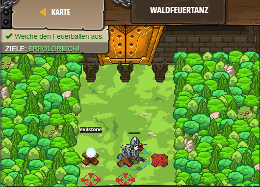

## **Waldfeuertanz**
## Level 4.11

#### Neu Gelerntes:
<b>-</b>

[comment]: <> (Was wurde gelernt und wie funktioniert die Technik?)

#### JavaScript-Code:
```js
// In diesem Level ist der Dunkelstein böse! Weiche ihm aus in dem du dich in die andere Richtung bewegst.
while (true) {
    var evilstone = hero.findNearestItem();
    if (evilstone) {
        var pos = evilstone.pos;
        if (pos.x == 34) {     // == means "is equal to"
            // Wenn der Dunkelstein links ist, geh nach rechts.
            hero.moveXY(46, 22);
        } else {
            // Wenn der Dunkelstein rechts ist, geh nach links.
            hero.moveXY(34, 23);
        }
    } else {
        // Wenn es keinen Dunkelstein gibt, geh in die Mitte.
        hero.moveXY(40, 22);
    }
}
```
