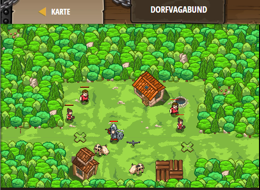

## **Dorfvagabund**
## Level 4.12

#### Neu Gelerntes:
Erste Einführung von Funktionen

[comment]: <> (Was wurde gelernt und wie funktioniert die Technik?)

#### JavaScript-Code:
```js
// Dies definiert eine Funktion namens findAndAttackEnemy
function findAndAttackEnemy() {
    var enemy = hero.findNearestEnemy();
    if (enemy) {
        hero.attack(enemy);
    }
}
// Diese Code ist nicht Teil der Funktion.
while(true) {
    // Nun kannst du mithilfe von findAndAttackEnemy durch das Dorf patroullieren
    hero.moveXY(39, 34);
    findAndAttackEnemy();
    
    // Gehe nun zum rechten Eingang.
    hero.moveXY(55, 31);
    // Benutze findeUndAttackiereGegner
    findAndAttackEnemy();
}
```
