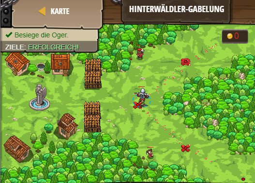

## **Hinterwälder-Eingabelung**
## Level 4.13

#### Neu Gelerntes:
Parameter

[comment]: <> (Was wurde gelernt und wie funktioniert die Technik?)

#### JavaScript-Code:
```js
// Benutze die Funktion checkAndAttack, damit sich dein Code gut liest.
// Diese Funktion hat einen Parameter.
// Mit einem Parameter kann man Daten in eine Funktion übergeben.
function checkAndAttack(target) {
    // Der Parameter ‘target‘ ist nur eine Variable!
    // Es enthält das Argument, wenn die Funktion aufgerufen wurde.
    if(target) {
        hero.attack(target);
    }
    hero.moveXY(43, 34);
}
while(true) {
    hero.moveXY(58, 52);
    var topEnemy = hero.findNearestEnemy();
    // Using the checkAndAttack function with the topEnemy variable.
    checkAndAttack(topEnemy);
    
    // Gehe zur unteren X-Markierung.
    hero.moveXY(58, 16);
    // Erstelle eine Variable namens bottomEnemy, und finde den nächsten Gegner.
var bottomEnemy = hero.findNearestEnemy();

    // Benutze die Funktion checkAndAttack und die bottomEnemy-Variable.
    checkAndAttack(bottomEnemy)
}
```
