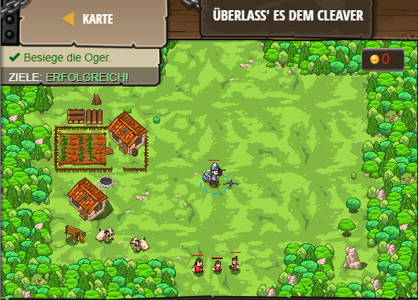

## **Überlass' es dem Cleaver**
## Level 4.14

#### Neu Gelerntes:
<b>-</b>

[comment]: <> (Was wurde gelernt und wie funktioniert die Technik?)

#### JavaScript-Code:
```js
// Das hier zeigt, wie man eine Funktion "cleaveWhenClose" definiert
// Diese Funktion definiert einen Parameter genannt target (Ziel)
function cleaveWhenClose(target) {
    if(hero.distanceTo(target) < 5) {
        // schreibe hier Deinen Angriffscode
        // wenn "cleave" bereit ist, dann benutze es auf das Ziel
        if (hero.isReady("cleave")) {
            hero.cleave(target);
        }
        // sonst, greife einfach das Ziel (target) an!
        hero.attack(target);
    }
}
// Dieser Code ist kein Teil der Funktion.
while(true) {
    var enemy = hero.findNearestEnemy();
    if(enemy) {
        // Beachte: innerhalb der Funktion "cleaveWhenClose" wird der Feind als "target" bezeichnet und nicht als "emeny".
        cleaveWhenClose(enemy);
    }
}
```
