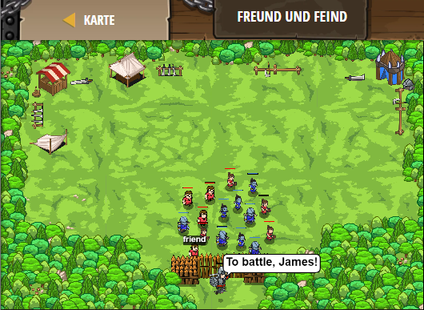

## **Freund und Feind**
## Level 4.15

#### Neu Gelerntes:
<b>-</b>

[comment]: <> (Was wurde gelernt und wie funktioniert die Technik?)

#### JavaScript-Code:
```js
// Bauern und Tagelöhner versammeln sich im Wald.
// Befiehl den Bauern zu kämpfen, und den Tagelöhnern, dass sie weggehen sollen!
while(true) {
    var friend = hero.findNearestFriend();
    if(friend) {
        hero.say("To battle, " + friend.id + "!");
    }
    // Finde jetzt die nächsten Gegner und sag ihnen, sie sollen verschwinden.
    var enemy = hero.findNearestEnemy();
    if (enemy) {
        hero.say("Go away" + enemy.id + "!");
    }
}
```
