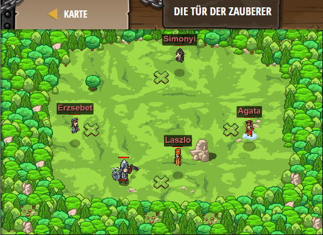

## **Die Tür der Zauberer**
## Level 4.16

#### Neu Gelerntes:
Werte von Variablen mit mit anderen Variablen bestimmen

[comment]: <> (Was wurde gelernt und wie funktioniert die Technik?)

#### JavaScript-Code:
```js
// Gehe zu Laszlo, damit er dir seine Geheimzahl gibt.
hero.moveXY(30, 13);
var las = hero.findNearestFriend().getSecret();
// Füge zu Laszlos Nummer 7 hinzu, um Erzsebets Nummer zu berechnen.
// Gehe zu Erzsebet und sage ihre magische Zahl.
var erz = las + 7;
hero.moveXY(17, 26);
hero.say(erz);
// Teile Erzsebets Nummer durch 4, um Simonyis Nummer zu berechnen
var sim = erz / 4;
// Gehe zu Simonyi und sag ihm seine Zahl.
hero.moveXY(30, 39);
hero.say(sim);
// Multipliziere Simonyis Nummer mit Laszlos, um Agatas Nummer zu berechnen.
var Aga = sim * las 
// Gehe zu Agata und sag ihr ihre Zahl.
hero.moveXY(43, 26);
hero.say(Aga);
```
