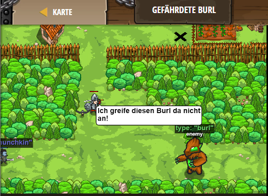

## **Gefährdete Burl**
## Level 4.18

#### Neu Gelerntes:
Art des Gegners erkennen und dementsprechend handeln 

[comment]: <> (Was wurde gelernt und wie funktioniert die Technik?)

#### JavaScript-Code:
```js
// Greife nur Feinde vom Type "munchkin" und "thrower" an.
// Greife keinen "burl" an. Lauf vor einem "ogre" weg!
while(true) {
    var enemy = hero.findNearestEnemy(); 
    // Erinnere dich: Greife keine "burl" Typen an!
    if (enemy.type == "burl") {
        hero.say("Ich greife diesen Burl da nicht an!");
    }
    // Die Eigenschaft "type" sagt dir, welche Kreaturenart es ist.
    if (enemy.type == "munchkin") {
        hero.attack(enemy);
    }
    // Nutze "if", um einen "thrower" anzugreifen.
    if (enemy.type == "thrower") {
        hero.attack(enemy);
    }
    // Wenn es ein "ogre" ist, dann lauf zu Tor des Dorfes!
    if (enemy.type == "ogre") {
        hero.moveXY(21, 40);
    }  
}
```
