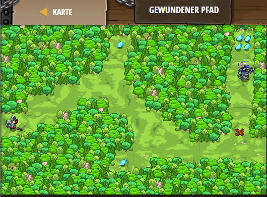

## **Gewundener Pfad**
## Level 4.2

#### Neu Gelerntes:
<b>-</b>

[comment]: <> (Was wurde gelernt und wie funktioniert die Technik?)

#### JavaScript-Code:
```js
// Gehe zum Ende des Pfades und errichte dort einen Zaun.
// Verwende deine moveXY(x,y) Funktion.

// Erster Wegpunkt.
hero.moveXY(36, 59);
// Gehe zum nächsten Wegpunkt.
hero.moveXY(37, 13);
// Zaun bauen und Oger stoppen.
hero.buildXY("fence", 72, 25);
```
