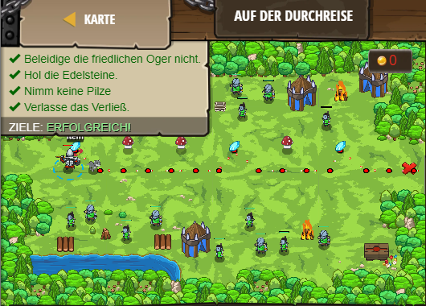

## **Auf der Durchreise**
## Level 4.24

#### Neu Gelerntes:
Ungleich mit "!="

[comment]: <> (Was wurde gelernt und wie funktioniert die Technik?)

#### JavaScript-Code:
```js
// Beleidige diesen Stamm friedlicher Oger nicht.
while(true) {
    var item = hero.findNearestItem();
    if(item) {
        // Falls item.type UNGLEICH “gem“ ist
        if(item.type != "gem") {
            // Dann folge deinem Wolfswelpen.
            hero.moveXY(pet.pos.x, pet.pos.y);
        }
        // Ansonsten:
        if (item.type == "gem") {
            hero.moveXY(item.pos.x, item.pos.y);
        }
            // Gehe zur Position des Edelsteins.      
    }
}
```
