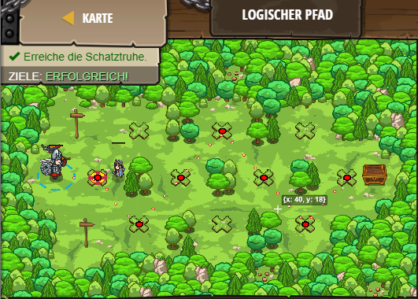

## **Logischer Pfad**
## Level 4.25

#### Neu Gelerntes:
<b>-</b>

[comment]: <> (Was wurde gelernt und wie funktioniert die Technik?)

#### JavaScript-Code:
```js
// Hole dir zwei true/false-Werte vom Zauberer.
// In der Anleitung findest du Hinweise dazu, wie man logische Ausdrücke schreibt.
hero.moveXY(14, 24);
var secretA = hero.findNearestFriend().getSecretA();
var secretB = hero.findNearestFriend().getSecretB();

// Wenn SOWOHL secretA als auch secretB wahr sind, nimm den hohen Pfad; ansonsten nimm den tiefen Pfad.
var secretC = secretA && secretB;
if (secretC){
    hero.moveXY(20, 33);
}
else{
    hero.moveXY(20, 15);
}
hero.moveXY(26, 24);

// Wenn secretA ODER secretB true ist, nimm den hohen Pfad.
if (secretA || secretB) {
    hero.moveXY(32, 33);
}
else {
    hero.moveXY(32, 16);
}
hero.moveXY(38, 24);
// Wenn secretB NICHT true ist, nimm den oberen Pfad.
if (secretB !== true) {
 hero.moveXY(44, 34);   
}
else {
    hero.moveXY(44, 15);
}
hero.moveXY(50, 24);
```
