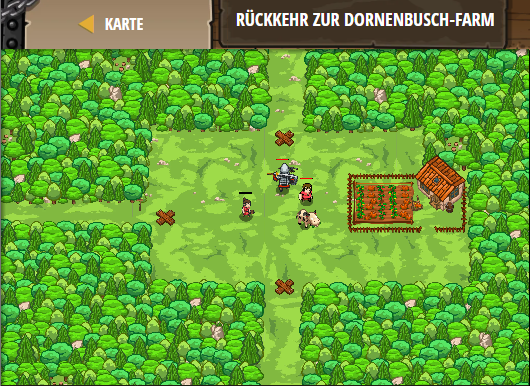

## **Rückkehr zur Dornenbusch-Farm**
## Level 4.26

#### Neu Gelerntes:
Funktion mit mehreren Parametern

[comment]: <> (Was wurde gelernt und wie funktioniert die Technik?)

#### JavaScript-Code:
```js
// Die Funktion maybeBuildTrap definiert ZWEI Parameter!
function maybeBuildTrap(x, y) {
    // Benutze x und y als Zielkoordinaten.
    hero.moveXY(x, y);
    var enemy = hero.findNearestEnemy();
    if(enemy) {
        // Benutze buildXY, um eine „fire-trap“ an dem angegebenen x und y zu bauen.
        hero.buildXY("fire-trap", x, y);
    }
}

while(true) {
    // Dies ruft maybeBuildTrap mit den Koordinaten des oberen Eingangs auf.
    maybeBuildTrap(43, 50);
    
    // Benutze nun maybeBuildTrap beim linken Eingang!
    maybeBuildTrap(25, 34);
    // Benutze nun maybeBuildTrap am unteren Eingang!
    maybeBuildTrap(43, 20)
}    
```
