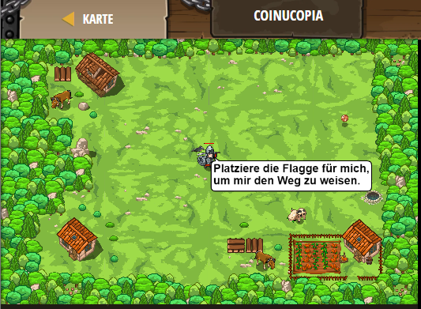

## **Coinucopia**
## Level 4.27

#### Neu Gelerntes:
Benutzung von Flaggen

[comment]: <> (Was wurde gelernt und wie funktioniert die Technik?)

#### JavaScript-Code:
```js
// Klicke "Senden" sobald du bereit bist die Flaggen zu platzieren.
// Flaggen-Buttons erscheinen links unten nach dem Klicken auf "Senden".
while(true) {
    var flag = hero.findFlag();
    if (flag) {
        hero.pickUpFlag(flag);
    }
    else {
        hero.say("Platziere die Flagge für mich, um mir den Weg zu weisen.");
    }
}
```
