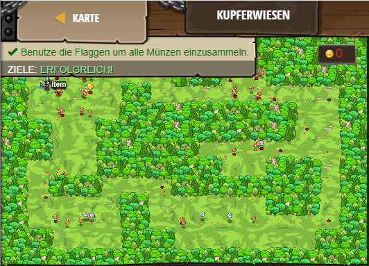

## **Kupferwiesen**
## Level 4.28

#### Neu Gelerntes:
<b>-</b>

[comment]: <> (Was wurde gelernt und wie funktioniert die Technik?)

#### JavaScript-Code:
```js
// Sammel alle Münzen auf jeder der Wiesen.
// Benutze Flaggen um zwischen den Wiesen hin und her zu laufen.
// Klicke "Senden" sobald du bereits bist die Flaggen zu platzieren.

while(true) {
    var flag = hero.findFlag();
    if (flag) {
        // Hebe die Flagge auf.
        hero.pickUpFlag(flag);
    } else {
        // Gehe automatisch zum nächsten Gegenstand, den du siehst.
        var item = hero.findNearestItem();
        if (item) {
            var position = item.pos;
            var x = position.x;
            var y = position.y;
            hero.moveXY(x, y);
        }
    }
}
```
