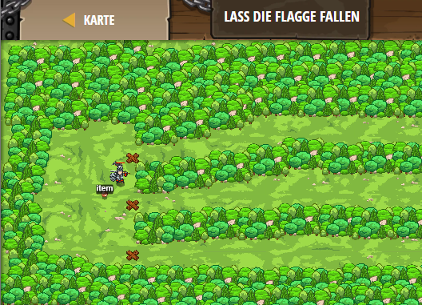

## **Lass die Flagge fallen**
## Level 4.29

#### Neu Gelerntes:
Auf die Koordinaten von Flaggen mit "flag.pos.x" und "flag.pos.y" zugreifen

[comment]: <> (Was wurde gelernt und wie funktioniert die Technik?)

#### JavaScript-Code:
```js
// Setze Flagge dort, wo du Fallen bauen möchtest.
// Wenn du keine Falls baust, dann sammle Münzen!

while(true) {
    var flag = hero.findFlag();
    if (flag) {
        // Wie bekommt man flagX und flagY von der Flaggenposition?
        // (Schaue weiter unten, wie man x und y von Gegenständen erhalten kann.)
        var flagPos = flag.pos
        var flagX = flagPos.x
        var flagY = flagPos.y
        hero.buildXY("fire-trap", flagX, flagY);
        hero.pickUpFlag(flag);
    }
    else {
        var item = hero.findNearestItem();
        if (item) {
            var itemPos = item.pos;
            var itemX = itemPos.x;
            var itemY = itemPos.y;
            hero.moveXY(itemX, itemY);
        }
    }
}
```
