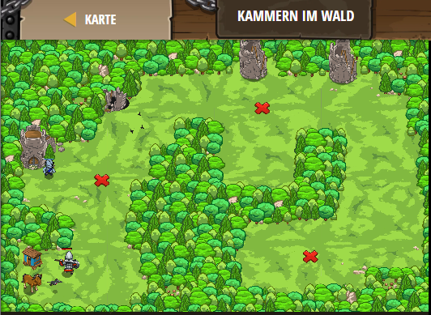

## **Kammern im Wald**
## Level 4.3

#### Neu Gelerntes:
<b>-</b>

[comment]: <> (Was wurde gelernt und wie funktioniert die Technik?)

#### JavaScript-Code:
```js
// Finde einen Weg durch den Wald, aber sei wachsam!
// In diesen Kammern könnten Oger sein!
hero.moveXY(19, 33);
var enemy = hero.findNearestEnemy();
// Die if-Anweisung wird prüfen ob eine Variable einen Oger hat.
if(enemy) {
    hero.attack(enemy);
    hero.attack(enemy);
}
hero.moveXY(49, 51);
enemy = hero.findNearestEnemy();
if(enemy) {
    // Greife den Feind hier an:
    hero.attack(enemy);
}
hero.moveXY(58, 14);
enemy = hero.findNearestEnemy();
// Nutze eine if-Anweisung um zu prüfen ob ein Feind existiert.
if (enemy) {
    hero.attack(enemy);
}
    // Wenn ein Find existiert, greife ihn an:
```
