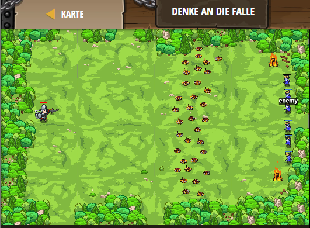

## **Denke an die Falle**
## Level 4.30

#### Neu Gelerntes:
<b>-</b>

[comment]: <> (Was wurde gelernt und wie funktioniert die Technik?)

#### JavaScript-Code:
```js
// Wenn du versuchst einen entfernten Gegner anzugreifen, wird dein Held in dessen Richtung ziehen und alle Flaggen ignorieren.
// Du musst aufpassen, dass du nur Gegner anzugreifst, die nah bei dir sind!

while(true) {
    var flag = hero.findFlag();
    var enemy = hero.findNearestEnemy();
    
    if(flag) {
        // Hole die Flagge.
        hero.pickUpFlag(flag);
        hero.say("Ich sollte die Flagge holen.");
    } else if(enemy) {
        // Greife nur an, wenn die Entfernung des Gegners <10 Metern beträgt.
    var distance = hero.distanceTo(enemy);
    if (distance < 10) {
        hero.attack(enemy);
    }
      
    }
}
```
