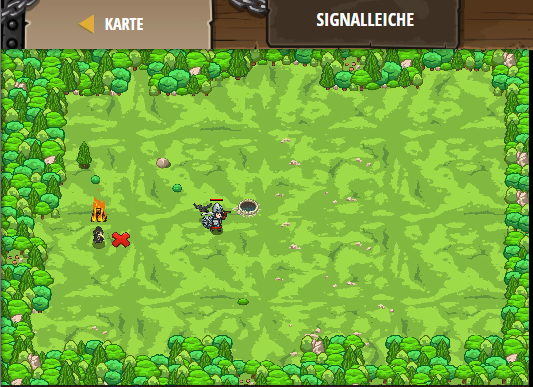

## **Signaleiche**
## Level 4.31

#### Neu Gelerntes:
Verschiedenen Flaggen verschiedene Aktionen zuweisen

[comment]: <> (Was wurde gelernt und wie funktioniert die Technik?)

#### JavaScript-Code:
```js
// Du kannst Flaggen verwenden um zwischen verschiedene Taktiken zu wählen.
// In diesem Level bedeutet die grüne Flagge, dass du dich dort hin bewegen willst.
// Die schwarze Flagge bedeutet, dass du dort "spalten" möchtest.
// Bei dem roten X heilt dich der Medizinmann.

while(true) {
    var green = hero.findFlag("green");
    var black = hero.findFlag("black");
    var nearest = hero.findNearestEnemy();
    
    if (green) {
        hero.pickUpFlag(green);
    } else if (black && hero.isReady("cleave")) {
        hero.pickUpFlag(black);
        // Spaltangriff!
        hero.cleave(nearest);
    } else if (nearest && hero.distanceTo(nearest) < 10) {
        // Angriff!
        hero.attack(nearest);
    }
}
```
