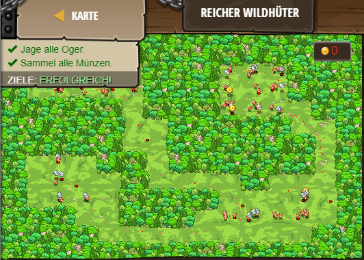

## **Reicher Wildhüter**
## Level 4.32

#### Neu Gelerntes:
<b>-</b>

[comment]: <> (Was wurde gelernt und wie funktioniert die Technik?)

#### JavaScript-Code:
```js
// Benutze "if" und "else if" um alle Situationen zu meistern.
// Setze alles zusammen, um Gegner zu besiegen und Münzen einzusammeln!
// Vergewissere dich, ob du eine sehr gute Rüstung im Laden gekauft hast! 400 Gesundheit empfohlen.
while(true) {
    var flag = hero.findFlag();
    var enemy = hero.findNearestEnemy();
    var item = hero.findNearestItem();
    if (flag) {
        // Was passiert wenn ich eine Flagge finde?
        hero.pickUpFlag(flag);
    }
    else if (enemy) {
        // Was passiert wenn ich einen Gegner finde?
        hero.attack(enemy);
    }
    else if (item) {
        // Was passiert wenn ich ein Item finde?
        hero.moveXY(item.pos.x, item.pos.y)
    }
}
```
