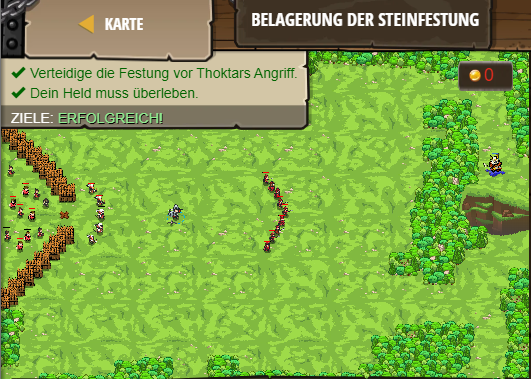

## **Belagerung der Steinfestung**
## Level 4.33

#### Neu Gelerntes:
<b>-</b>

[comment]: <> (Was wurde gelernt und wie funktioniert die Technik?)

#### JavaScript-Code:
```js
// Hilf deinen Freunden die Knechte zu besiegen, die Thoktar schickt.
// Du benötigst ausgezeichnetes Material und Strategien um zu gewinnen.
// Flaggen können helfen, aber das ist dir überlassen–sei kreativ!
// Hinter dem Zaun ist ein Heiler. Begib dich zum X um geheilt zu werden!
while(true) {
   var fla = hero.findFlag("black");
    if (fla) {
        hero.pickUpFlag(fla);
        
        if (hero.isReady("warcry")) {
            hero.warcry();
        }
    }
    var flag = hero.findFlag("green");
if (flag) {
    hero.pickUpFlag(flag);
}
var enemy = hero.findNearestEnemy();
if (enemy) {
    hero.attack(enemy);
}
}
```
