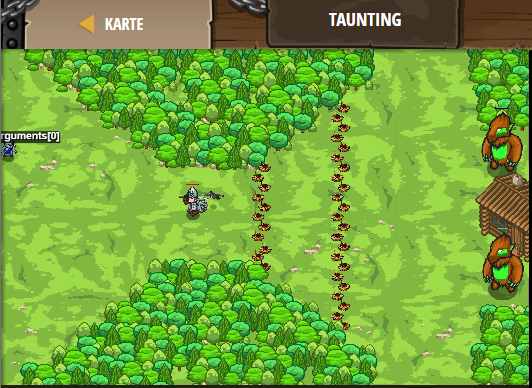

## **Taunting**
## Level 4.34

#### Neu Gelerntes:
<b>-</b>

[comment]: <> (Was wurde gelernt und wie funktioniert die Technik?)

#### JavaScript-Code:
```js
// Attack munchkins, call brawlers and ignore burls.

// This function defines the hero's behaviour about enemies.
function dealEnemy(enemy) {
    // If enemy.type is "munchkin":
    if (enemy.type == "munchkin") {
       hero.attack(enemy);
    }
        // Then attack it:    
    // If the enemy's type is "brawler":
    if (enemy.type == "brawler") {
            hero.say("hi");
        }
        // Then say something to call the brawler:  
}
while (true) {
    var enemy = hero.findNearestEnemy();
    if (enemy) {
        dealEnemy(enemy);
    }
    else {
        hero.moveXY(30, 34);
    }
}
```
