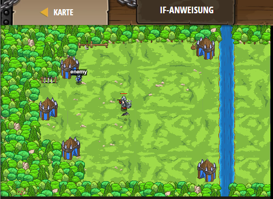

## **If-Anweisung**
## Level 4.4

#### Neu Gelerntes:
<b>-</b>

[comment]: <> (Was wurde gelernt und wie funktioniert die Technik?)

#### JavaScript-Code:
```js
// Besiege die Oger aus ihrem eigenen Lager heraus!
while(true) {
    var enemy = hero.findNearestEnemy();
    // Benutze ein `if-statement`, um zu prüfen, ob ein Gegner existiert:
    if (enemy) {
        hero.attack(enemy);
    }
        // Greife den Gegner an, falls er existiert.
        
}
```
