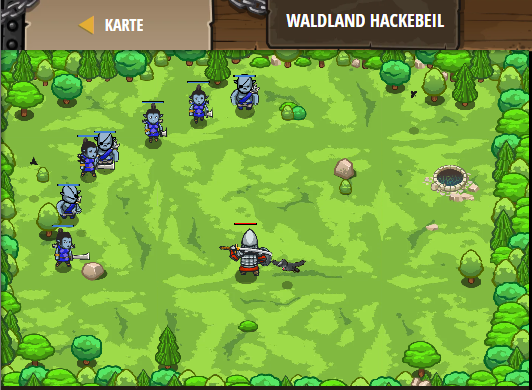

## **Waldland Hackebeil**
## Level 4.6

#### Neu Gelerntes:
<b>-</b>

[comment]: <> (Was wurde gelernt und wie funktioniert die Technik?)

#### JavaScript-Code:
```js
// Nutze deine neue Spalten (`cleave`) Fähigkeit so oft wie möglich.
hero.moveXY(23, 23);
while(true) {
    var enemy = hero.findNearestEnemy();
    if (hero.isReady("cleave")) {
        // Teile und herrsche.
        hero.cleave(enemy);
    }
    else {
        // Ansonsten (wenn `cleave` nicht bereit ist), mach deine normale Attacke.
        hero.attack(enemy);
    }
}
```
