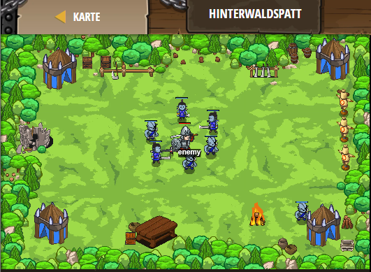

## **Hinterwaldspatt**
## Level 4.7

#### Neu Gelerntes:
<b>-</b>

[comment]: <> (Was wurde gelernt und wie funktioniert die Technik?)

#### JavaScript-Code:
```js
// Die Zwerge greifen an!
// Schwärme von Zwergen kommen in regelmäßigen Zeitabständen.
// Wann immer du kannst, teile (cleave), um die Masse an Feinden auszulichten.
while(true) {
    var enemy = hero.findNearestEnemy();
    // Benutze ein if-Statement mit isReady, um „spalten“ zu überprüfen:
    if (hero.isReady("cleave")) {
        hero.cleave(enemy);
    }
        // Spalten!
        else {
            hero.attack(enemy);
        }
    // Sonst, wenn cleave nicht bereit ist:
    
        // Greife den nächsten Oger an!  
}
```
