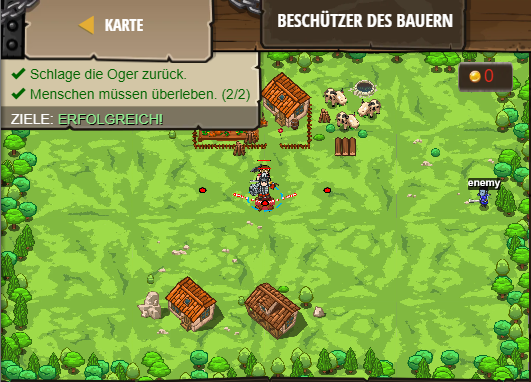

## **Beschützer des Bauern**
## Level 4.9

#### Neu Gelerntes:
Wert der Distanz durch "hero.distanceTo() < x" mit Wert x vergleichen

[comment]: <> (Was wurde gelernt und wie funktioniert die Technik?)

#### JavaScript-Code:
```js
while(true) {
    var enemy = hero.findNearestEnemy();
    var distance = hero.distanceTo(enemy);
    if (distance < 10) {
        // Greife an, wenn sie dem Bauern zu Nahe kommen.
        if (hero.isReady("cleave")) {
            hero.cleave(enemy);
        }
        else {
            hero.attack(enemy);
        }
    }
    // Bleibe ansonsten nahe bei dem Bauern! Benutze else.
    else {
        hero.moveXY(40, 37);
    }
}
```
