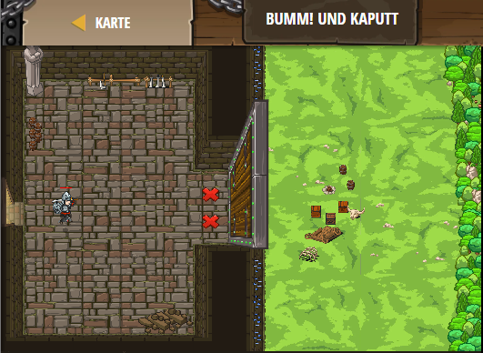

## **Bumm! Und kaputt**
## Level 4.b1

#### Neu Gelerntes:
<b>-</b>

[comment]: <> (Was wurde gelernt und wie funktioniert die Technik?)

#### JavaScript-Code:
```js
// Nutze deinen buildXY Hammer, um zwei "Feuer-Fallen" (fire-trap) in der Nähe vom Tor zu bauen.
// Sie werden explodieren, wenn du wieder in sicherer Entferung bist!
// Dann lauf in den Wald weg!
hero.buildXY("fire-trap", 35, 35);
hero.buildXY("fire-trap", 35, 29);
hero.moveLeft();
hero.moveRight(3);
```
