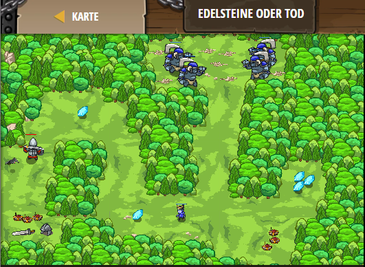

## **Edelsteine oder Tod**
## Level 4.b10

#### Neu Gelerntes:
<b>-</b>

[comment]: <> (Was wurde gelernt und wie funktioniert die Technik?)

#### JavaScript-Code:
```js
// Die Kommandos nach einer If-Anweisung werden nur dann ausgeführt. wenn die Bedingung wahr ist.
// Repariere alle If-Anweisungen, um das Level zu schlagen.

// == bedeutet "ist gleich mit".
if (1 + 1 == 3) {  // ∆ Mach, dass es falsch (false) ist.
    hero.moveXY(5, 15);  // Gehe zu den ersten Minen.
}
if (2 + 2 == 4) {  // ∆ Mach, dass es wahr (true) ist.
	hero.moveXY(15, 40);  // Gehe zum ersten Edelstein.
}
// != bedeutet "ist nicht gleich mit"
if (2 + 2 == 4) {  // ∆ Mach, dass es wahr (true) ist.
	hero.moveXY(25, 15);  // Gehe zum zweiten Edelstein.
}
// < bedeutet "ist kleiner als".
if (2 + 2 > 3) {  // ∆ Mach, dass es wahr (true) ist.
    var enemy = hero.findNearestEnemy();
    hero.attack(enemy);
}
if (2 > 4) {  // ∆ Mach, dass es falsch (false) ist.
	hero.moveXY(40, 55);
}
if (false) {  // ∆ Mach, dass es falsch (false) ist.
	hero.moveXY(50, 10);
}
if (true) {  // ∆ Mach, dass es wahr (true) ist.
	hero.moveXY(55, 25);
}
```
