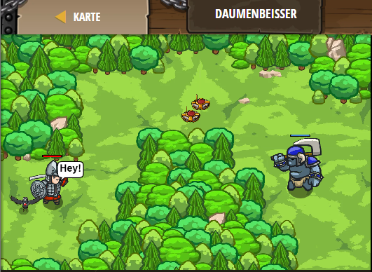

## **Daumenbeisser**
## Level 4.b11

#### Neu Gelerntes:
<b>-</b>

[comment]: <> (Was wurde gelernt und wie funktioniert die Technik?)

#### JavaScript-Code:
```js
// Die Befehle unter einer if-Anweisung werden nur ausgeführt, wenn die if-Bedingung zutrifft.
// Bei einer Bedingung bedeutet == "ist gleich"
if (2 + 2 == 4) {
    hero.say("Hey!");
}
if (2 + 2 == 4) {
    hero.say("Yes, you!");
}

// Ändere hier die Bedingung, dass dein Held sagt "Come at me!" Komm doch her!
if (3 + 3 == 6) {  // ∆ Ändere dies, so dass es wahr (true) ist.
    hero.say("Komm doch her!");
}

if (2 == 2) {  // ∆ Ändere dies, so dass es wahr (true) ist.
    // Füge hier einen weiteren Spott ein um den Oger anzulocken. Sei kreativ!
hero.say("Achtung da sind Minen");
}
```
