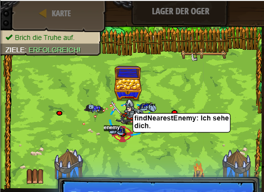

## **Lager der Oger**
## Level 4.b13

#### Neu Gelerntes:
<b>-</b>

[comment]: <> (Was wurde gelernt und wie funktioniert die Technik?)

#### JavaScript-Code:
```js
// Wenn ein Feind in der Nähe ist, greife ihn an.
// Andernfalls, greife die Truhe an.
while(true) {
    // Verwende if/else.
    var enemy = hero.findNearestEnemy();
    if (enemy) {
        hero.attack(enemy);
    }
    else {
           hero.attack("Chest");
    } 
}
```
