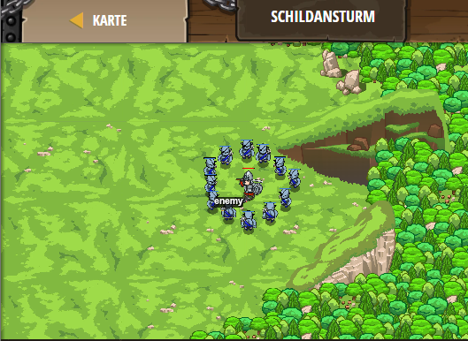

## **Schildansturm**
## Level 4.b14

#### Neu Gelerntes:
<b>-</b>

[comment]: <> (Was wurde gelernt und wie funktioniert die Technik?)

#### JavaScript-Code:
```js
// Überlebe beide Wellen durch das Schild-Hochhalten und Spalten (shield und cleave).
// Wenn "cleave" nicht bereit ist, benutze deine "shield" Fähigkeit.
// Du benötigt mindeten 142 Gesundheit, um zu überleben.
while(true) {
var enemy = hero.findNearestEnemy();
if (hero.isReady("cleave")) {
    hero.cleave(enemy);
    
}
else {
    hero.shield();
}
}
```
