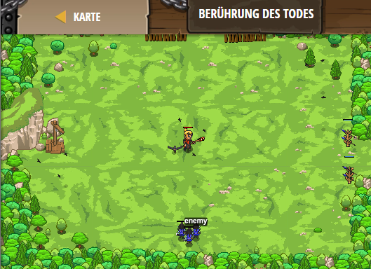

## **Berührung des Todes**
## Level 4.b16

#### Neu Gelerntes:
<b>-</b>

[comment]: <> (Was wurde gelernt und wie funktioniert die Technik?)

#### JavaScript-Code:
```js
while(true) {
    var enemy = hero.findNearestEnemy();
    if (enemy) {
        var distance = hero.distanceTo(enemy);
        if (distance < 15) {
            // Wende den "Leben-absaugen" Zauberspruch beim Feind an.
            hero.cast("drain-life", enemy);
        }
        else {
            // Greife den Feid mit deinem Stab an.
            hero.attack(enemy);
        }
    }
}
```
