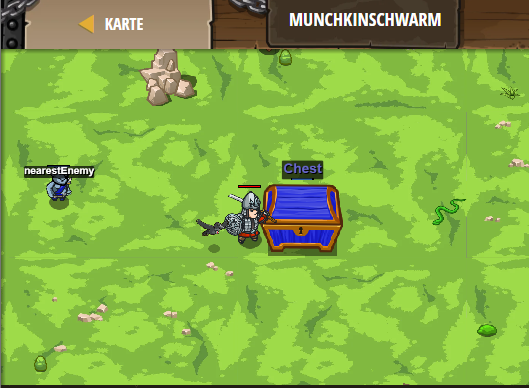

## **Munchkinschwarm**
## Level 4.b18

#### Neu Gelerntes:
<b>-</b>

[comment]: <> (Was wurde gelernt und wie funktioniert die Technik?)

#### JavaScript-Code:
```js
while(true) {
    // Überprüfe die Distanz zum nächsten Feind.
    var nearestEnemy = hero.findNearestEnemy();
    var distance = hero.distanceTo(nearestEnemy);
    // Wenn er näher, als 10m kommt, nutze zerteilen.
    if (nearestEnemy) {
    if(distance < 10) {
        hero.cleave(nearestEnemy);
    }     
   
    
    // Sonst: greife die Truhe ("Chest") an.
    else {
        hero.attack("Chest");
    }
}
}
```
