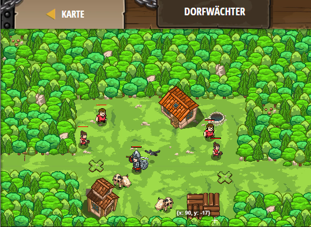

## **Dorfwächter**
## Level 4.b19

#### Neu Gelerntes:
<b>-</b>

[comment]: <> (Was wurde gelernt und wie funktioniert die Technik?)

#### JavaScript-Code:
```js
while(true) {
    hero.moveXY(35, 34);
    var leftEnemy = hero.findNearestEnemy();
    if (leftEnemy) {
        hero.attack(leftEnemy);
        hero.attack(leftEnemy);
    }
    // Nun weiter zum rechten Zugang.
    hero.moveXY(60, 31);
    // Finde den Feind auf der rechten Seite.
    var rightEnemy = hero.findNearestEnemy();
    if (rightEnemy) {
        hero.attack(rightEnemy);
        hero.attack(rightEnemy);
    }
    // Verwende "if", um anzugreifen, wenn dort ein Feind(right enemy) ist.
}
```
