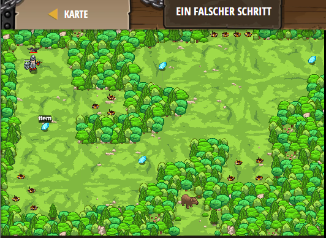

## **Ein falscher Schritt**
## Level 4.b2

#### Neu Gelerntes:
<b>-</b>

[comment]: <> (Was wurde gelernt und wie funktioniert die Technik?)

#### JavaScript-Code:
```js
// Der Held ist total verwirrt!
// Korrigiere ihren Pfad, damit sie nicht auf die Minen laufen.  
while(true) {
    var item = hero.findNearestItem();
if (item) {
hero.moveXY(item.pos.x, item.pos.y);
}  
else {
  hero.moveXY(40, 20);
}
}
```
