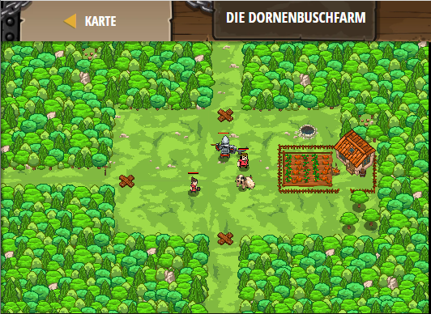

## **Die Dornenbuschfarm**
## Level 4.b20

#### Neu Gelerntes:
<b>-</b>

[comment]: <> (Was wurde gelernt und wie funktioniert die Technik?)

#### JavaScript-Code:
```js
while(true) {
    hero.moveXY(43, 50);
    var top = hero.findNearestEnemy();
    if (top) {
        hero.buildXY("fire-trap", 43, 50);
    }
    hero.moveXY(25, 34);
    var left = hero.findNearestEnemy();
    // Prüfe, ob `left` existiert.
    if (left) {
        hero.buildXY("fire-trap", 25, 34);
    }
        // Wenn ein Gegner existiert, baue eine Feuerfalle ("fire-trap") bei Position 25, 34.
    hero.moveXY(43, 20);
    // Setze eine Variable für den Gegner am unteren Eingang.
    var bottom = hero.findNearestEnemy();
    if (bottom) {
        hero.buildXY("fire-trap", 43, 20);
    }      
}
```
