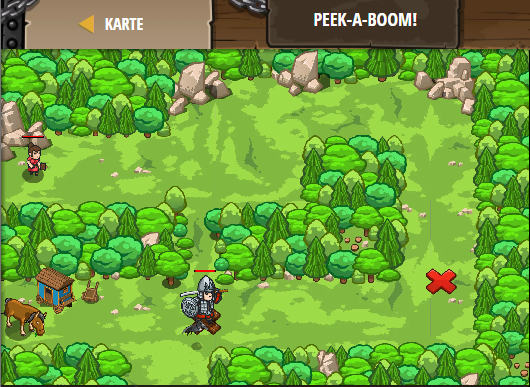

## **Peek-a-boom**
## Level 4.b21

#### Neu Gelerntes:
<b>-</b>

[comment]: <> (Was wurde gelernt und wie funktioniert die Technik?)

#### JavaScript-Code:
```js
while(true) {
    var enemy = hero.findNearestEnemy();
    if(enemy) {
        // Build a "fire-trap" at the Red X (41, 24)
        hero.buildXY("fire-trap", 41, 24);
    }
    // Add an else below to move back to the clearing
    else {
        hero.moveXY(19, 19);
    }
}
```
