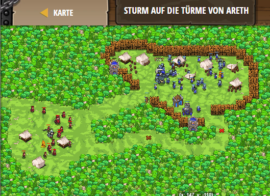

## **Sturm auf die Türme von Areth**
## Level 4.b22

#### Neu Gelerntes:
<b>-</b>

[comment]: <> (Was wurde gelernt und wie funktioniert die Technik?)

#### JavaScript-Code:
```js
hero.moveXY(55, 14);
hero.moveXY(92, 9);

// Baue eine Feuerfalle ('fire-trap') auf das rote X.
hero.buildXY("fire-trap", 94, 19);
// Ziehe dich zum hözernen X zurück.
hero.moveXY(56, 14);
// Warte bis der Kanonier die glänzende Feuerfalle untersucht.
// Betrete das Camp und lege Feuerfallen auf jedes rote X.
hero.moveXY(80, 40);
hero.buildXY("fire-trap", 90, 53);
hero.buildXY("fire-trap", 60, 62);
// Benutze die 'say' Methode um deinen Truppen den Rückzug ('retreat') zu signalisieren.
hero.say("retreat");
// Flieh zum hölzernen X auf der linken Seite.
hero.moveXY(-12, 38);
```
