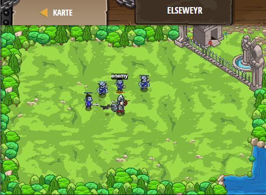

## **Elseweyr**
## Level 4.b23

#### Neu Gelerntes:
<b>-</b>

[comment]: <> (Was wurde gelernt und wie funktioniert die Technik?)

#### JavaScript-Code:
```js
while(true) {
    var enemy = hero.findNearestEnemy();
    if(hero.isReady("cleave")) {
        hero.cleave();
    }
    // Schreibe else: um etwas zu tun, wenn cleave nicht bereit ist:
    else {
        hero.attack(enemy);
    }
}
```
