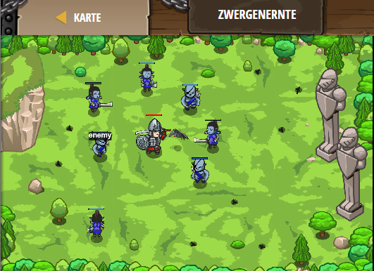

## **Zwergenernte**
## Level 4.b25

#### Neu Gelerntes:
<b>-</b>

[comment]: <> (Was wurde gelernt und wie funktioniert die Technik?)

#### JavaScript-Code:
```js
while(true) {
    var enemy = hero.findNearestEnemy();    
    if (hero.isReady("cleave")) {
        hero.cleave(enemy); 
    }
    else {
        hero.shield();        
    }
}
```
