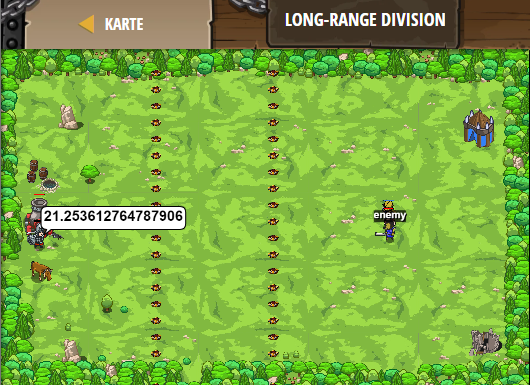

## **Long-range Division**
## Level 4.b26

#### Neu Gelerntes:
<b>-</b>

[comment]: <> (Was wurde gelernt und wie funktioniert die Technik?)

#### JavaScript-Code:
```js
var enemy = hero.findNearestEnemy();
var distanceToEnemy = hero.distanceTo(enemy);
// Say the result of the operation: distanceToEnemy divided by 3
hero.say(distanceToEnemy / 3);
hero.say("Fire!");
// Say second range: distanceToEnemy divided by 1.5
hero.say(distanceToEnemy / 1.5);
hero.say("Fire!");
// Say these things for motivation. Really. Trust us.
hero.say("Woo hoo!");
hero.say("Here we go!");
hero.say("Charge!!");
// Now, use a while-true loop to attack the enemies.
while(true) {
    var enemy = hero.findNearestEnemy();
    hero.attack(enemy);
}
```
