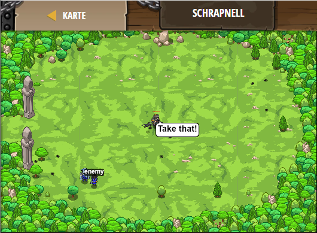

## **Schrapnell**
## Level 4.b27

#### Neu Gelerntes:
<b>-</b>

[comment]: <> (Was wurde gelernt und wie funktioniert die Technik?)

#### JavaScript-Code:
```js
while(true) {
    var enemy = hero.findNearestEnemy();
    if (enemy) {
        if (hero.isReady("throwAt")) {
            var distance = hero.distanceTo(enemy);
            // Only throwAt if the ogres are more than 15m away.
            // Nutze "i" um die Entfernung mit 15 zu vergleichen.
            if (distance >= 15) {
                hero.throwAt(enemy);
            }
            // Nutze "else" um anzugreifen wenn du nicht wirfst.
            else {
                hero.attack(enemy);
            }
        }
        else {
            hero.attack(enemy);
        }
    }
}
```
