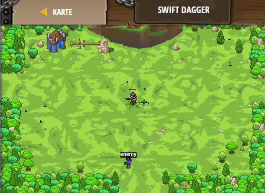

## **Swift Dagger**
## Level 4.b28

#### Neu Gelerntes:
<b>-</b>

[comment]: <> (Was wurde gelernt und wie funktioniert die Technik?)

#### JavaScript-Code:
```js
while(true) {
    var enemy = hero.findNearestEnemy();
    if (enemy) {
        var distance = hero.distanceTo(enemy);
        if (distance < hero.throwRange) {
            // Throw your dagger at the enemy if "throwAt" is ready.
            hero.throwAt(enemy);
        }
        else {
            // Attack the enemy with your bow.
            hero.attack(enemy);
        }
    }
}
```
