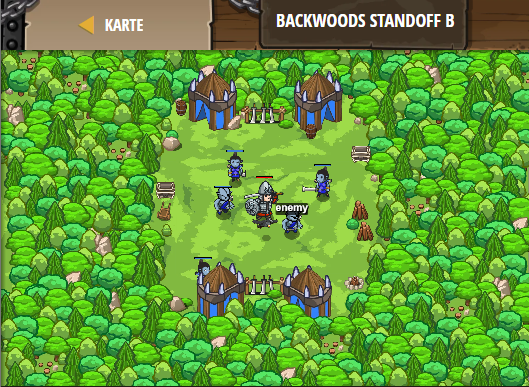

## **Backwoods Standoff B**
## Level 4.b29

#### Neu Gelerntes:
<b>-</b>

[comment]: <> (Was wurde gelernt und wie funktioniert die Technik?)

#### JavaScript-Code:
```js
while(true) {
    var enemy = hero.findNearestEnemy();
    // Use an if-statement with isReady to check "cleave":
    if (hero.isReady("cleave")) {
        hero.cleave(enemy);       
    }
    else {
        hero.attack(enemy);
    }
}
```
