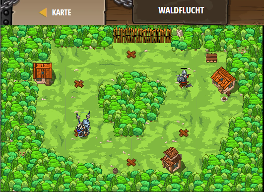

## **Waldflucht**
## Level 4.b3

#### Neu Gelerntes:
<b>-</b>

[comment]: <> (Was wurde gelernt und wie funktioniert die Technik?)

#### JavaScript-Code:
```js
while(true) {
    hero.moveXY(56,44);
     hero.moveXY(40,56);
     hero.moveXY(24, 44);
    hero.moveXY(24, 24);
    hero.moveXY(40, 12);
    hero.moveXY(56, 24);
}
```
