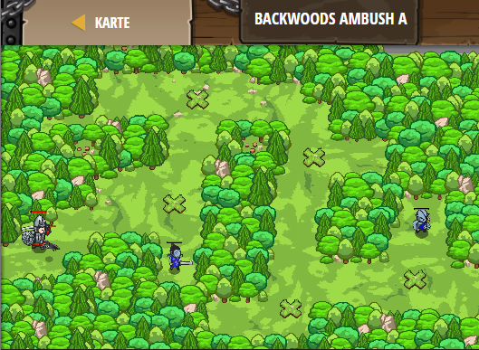

## **Backwoods Ambush A**
## Level 4.b30

#### Neu Gelerntes:
<b>-</b>

[comment]: <> (Was wurde gelernt und wie funktioniert die Technik?)

#### JavaScript-Code:
```js
function checkAndAttack(x, y) {
    hero.moveXY(x, y);
    var enemy = hero.findNearestEnemy();
    if (enemy) {
        hero.attack(enemy);
    }
}
checkAndAttack(24, 42);
checkAndAttack(27, 60);
checkAndAttack(42, 50);
checkAndAttack(39, 24);
checkAndAttack(55, 29);
```
