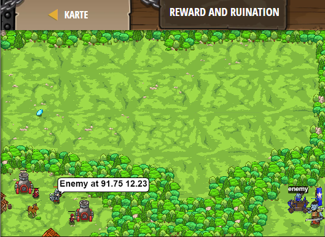

## **Reward and Ruination**
## Level 4.b31

#### Neu Gelerntes:
<b>-</b>

[comment]: <> (Was wurde gelernt und wie funktioniert die Technik?)

#### JavaScript-Code:
```js
while(true) {
    var enemy = hero.findNearestEnemy();
    if(enemy) {
        var enemyPos = enemy.pos.x + " " + enemy.pos.y;
        hero.say("Enemy at " + enemyPos);
    }
    var item = hero.findNearestItem();
    if (item) {
        var itemPos = item.pos.x + " " + item.pos.y
        hero.say("Item at " + itemPos);
    }
}
```
