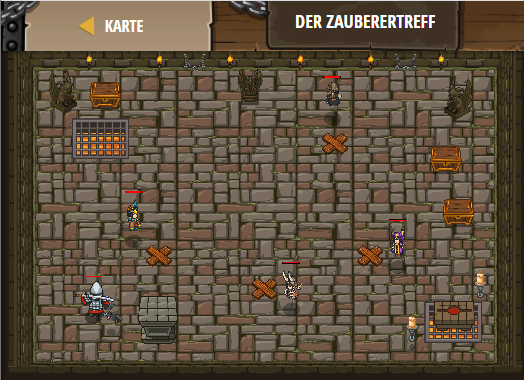

## **Der Zauberertreff**
## Level 4.b32

#### Neu Gelerntes:
<b>-</b>

[comment]: <> (Was wurde gelernt und wie funktioniert die Technik?)

#### JavaScript-Code:
```js
hero.moveXY(18, 20);
var zso = hero.findNearestFriend().getSecret();
var mih = zso / 4;
hero.moveXY(30, 15);
hero.say(mih);
var bea = mih / 5
hero.moveXY(41, 20);
hero.say(bea);
var san = mih - bea
hero.moveXY(38, 37);
hero.say(san);
```
