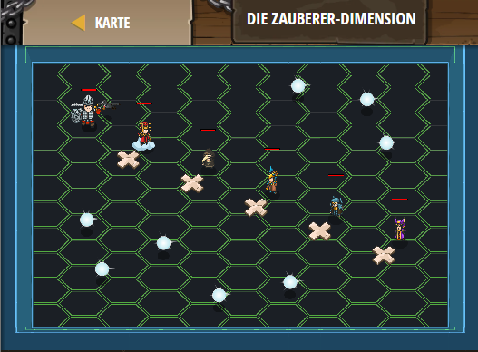

## **Die Zauberer-dimension**
## Level 4.b33

#### Neu Gelerntes:
<b>-</b>

[comment]: <> (Was wurde gelernt und wie funktioniert die Technik?)

#### JavaScript-Code:
```js
hero.moveXY(16, 32);
var esz = hero.findNearestFriend().getSecret();
var tam = esz * 3 - 2;
hero.moveXY(24, 28);
hero.say(tam);
var zso = (tam - 1) * 4;
hero.moveXY(32,24);
hero.say(zso);
var ist = (tam + zso) / 2;
hero.moveXY(40, 20);
hero.say(ist);
var csi = (tam + zso) * (zso - ist);
hero.moveXY(48, 16);
hero.say(csi);
```
