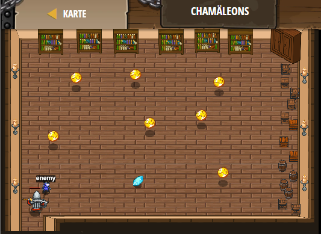

## **Chamäleons**
## Level 4.b34

#### Neu Gelerntes:
<b>-</b>

[comment]: <> (Was wurde gelernt und wie funktioniert die Technik?)

#### JavaScript-Code:
```js
while (true) {
    var enemy = hero.findNearestEnemy();
    // Wenn du einen Feind siehst - greife an:
    if (enemy) {
        hero.attack(enemy);
    }
    var item = hero.findNearestItem();
    // Wenn du eine Münze oder einen Edelstein siehst - bewege dich zu dessen X- und Y-Koordinate.
    if (item) {
        hero.moveXY(item.pos.x, item.pos.y);
    }
}
```
