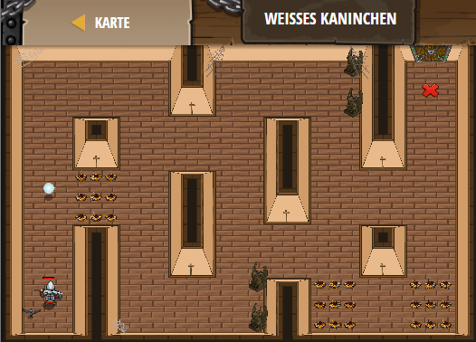

## **Weisses Kaninchen**
## Level 4.b35

#### Neu Gelerntes:
<b>-</b>

[comment]: <> (Was wurde gelernt und wie funktioniert die Technik?)

#### JavaScript-Code:
```js
while (true) {
    var item = hero.findNearestItem();
    if (item) {
        // Speichere die Position des Elements in einer neuen Variablen mit Hilfe von item.pos:
        hero.moveXY(item.pos.x, item.pos.y);
    }
}
```
