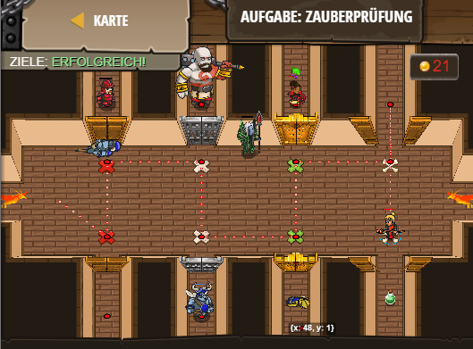

## **Aufgabe: Zauberprüfung**
## Level 4.b36

#### Neu Gelerntes:
<b>-</b>

[comment]: <> (Was wurde gelernt und wie funktioniert die Technik?)

#### JavaScript-Code:
```js
function r() {
    var item = hero.findNearestItem();
if (item.type != "poison") {
    hero.moveXY(item.pos.x, item.pos.y);
}
}
function q(x) {
    if (x == 1) {
        hero.cast("heal", hero.findNearestFriend());
    }
    if (x == 2) {
        hero.cast("force-bolt", hero.findNearestEnemy());
    }
    if (x == 3) {
        hero.cast("grow", hero.findNearestFriend());
    }
    if (x == 4) {
        hero.cast("shrink", hero.findNearestEnemy());
    }
    if (x == 5) {
        hero.cast("regen", hero.findNearestFriend());
    }
    if (x == 6) {
        hero.cast("poison-cloud", hero.findNearestEnemy());
    }
}
function a(pair) {
    var friend = hero.findNearestFriend();
    if (friend) {
        q(pair + 1);
    } else {
        q(pair + 2);
    }
}
hero.moveXY(18, 24);
a(0);
hero.moveXY(18, 41);
a(0);
hero.moveXY(34, 41);
a(2);
hero.moveXY(34, 24);
a(2);
hero.moveXY(50, 24);
a(4);
hero.moveXY(50, 41);
a(4);
hero.moveXY(66, 41);
var item = hero.findNearestItem();
r();
hero.moveXY(66, 24);
r();
```
